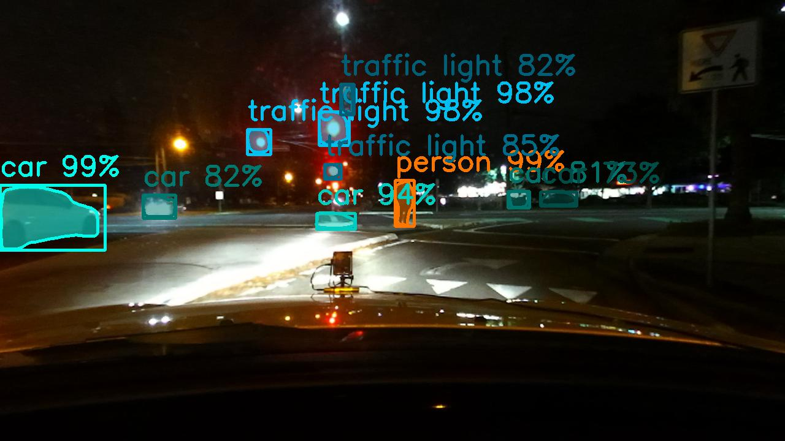
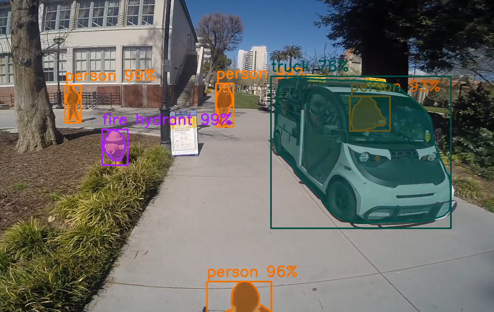
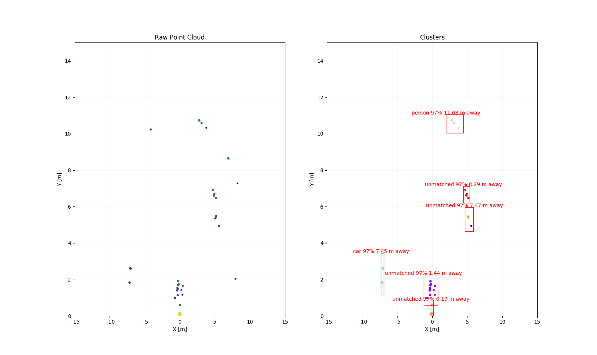

# mercedes-clk-perception

## 1. Install ROS melodic:
Instructions are available at:
http://wiki.ros.org/melodic/Installation/Ubuntu

## 2. install dependencies:
```bash
pip3 install -r requirements.txt
```
Most of the packages are already provided with ROS. Virutal environment is preferable.

## 3. Download rosbags:


## 4. Run nodes:
```bash
python3 fusion_node/main.py
python3 gps_node/main.py
python3 radar_node/main.py
python3 2d_detection_node/main.py #(additional instructions in 2d_detection_node/README.md)
```

## 5. Play rosbag:
```bash
roscore
rosbag play 720loop1.bag
```

## 6. Check if nodes are working:
If everything worked out successfully
```bash
$ rostopic list
```
Should contain the following elements:
```bash
#standard ros topics
/rosout
/rosout_agg

#raw data:
/fix
/ti_mmwave/radar_scan_pcl
/zed_node/left/image_rect_color

/2d_node/output_image #2D detection pipeline
/2d_node/results

/gps_node/heading #gps pipeline
/gps_node/speed

/radar_pipeline/clusters #radar pipeline

```
Your final setup can look simmilar to this one:


# Results

There are some examples of the inference below. All examples of 2D inference generated with the system are avalable in https://github.com/tomek-l/mercedes-clk-perception/tree/master/images

For more information, go see the paper https://github.com/tomek-l/mercedes-clk-perception/blob/master/docs/CMPE297_03_PilotA.pdf






